# 🧑‍💼 Employee Attrition Prediction — HR Retention Risk Scoring

[](https://github.com/narendrakalam2001/employee-attrition-prediction-mlops/actions)
[](https://python.org)
[](https://fastapi.tiangolo.com)
[](https://streamlit.io)
[-brightgreen.svg)](https://scikit-learn.org/stable/modules/neural_networks_supervised.html)
[](https://docker.com)
[](https://mlflow.org)
[](tests/test_pipeline_core.py)
[](LICENSE)

> **Domain:** HR Tech / People Analytics
> **Problem:** Binary Classification + 3-Tier Decision Engine — predict employee attrition risk and route it to RETAIN / MONITOR / INTERVENE
> **Dataset:** [IBM HR Analytics Employee Attrition & Performance — 1,470 employees · 35 attributes](https://www.kaggle.com/datasets/pavansubhasht/ibm-hr-analytics-attrition-dataset)
> **Industry Context:** TCS · Accenture · Infosys · Wipro — People Analytics teams use attrition scoring exactly like this to flag flight-risk employees **before** resignation, saving **₹5–15L per avoided replacement**

---

## 💡 Why This Project Matters

Losing a trained employee costs far more than their salary — recruiting, onboarding, and 3–6 months of ramp-up productivity loss typically add up to **₹5–15L per replacement**. This system simulates a production-grade People Analytics retention pipeline:

- A **Neural Network (MLP)** trained on **13 engineered HR signals** (satisfaction composite, job-hopping score, promotion-gap ratio, manager stability) predicts attrition probability
- **SMOTENC** handles severe class imbalance (16.1% positive rate) while respecting mixed categorical + continuous feature types
- The **3-Tier Retention Engine** applies hard + soft HR business rules **before** the ML score — e.g. sustained overtime + chronic dissatisfaction fires `INTERVENE` regardless of raw probability, mirroring how real HR retention systems prioritize known strong drivers
- Every model promotion goes through a **3-gate Champion-Challenger** check — no model reaches production without demonstrably better ROC-AUC and generalization than the current champion
- A **₹-denominated cost-sensitive evaluation** reframes model error as business impact — not "F1 = 0.39," but "here's what missed attriters and false alarms cost in rupees"

This lets HR managers spend intervention time (1:1s, comp reviews, role changes) on the employees who actually need it — before they hand in a resignation letter.

---

## 🏆 Champion Model Results

| Metric | Score |
|---|---|
| **Best Model** | `NeuralNet (MLP)` |
| **F1 Score** | `0.3902` |
| **Precision** | `0.3158` |
| **Recall** | `0.5106` |
| **ROC-AUC** | `0.6698` |
| **KS Statistic** | `0.3001` |
| **Brier Score (post-calibration)** | `0.1296` |
| **Lift @ 5%** | `0.6655` |
| **Active decision threshold** | `0.3333` (isotonic-calibrated) |
| **Total estimated cost (test set, 294 employees)** | `₹19.59L` |

> *IBM's HR Attrition dataset is a genuinely hard, heavily imbalanced problem (16.1% positive class, weak individual predictors). Most rigorous public solutions cap out around F1 0.35–0.55 for the minority class without target leakage — these numbers are the honest result of the pipeline above, not inflated.*

---

## 🔗 Live Links

| Service | URL |
|---|---|
| 🚀 **FastAPI (Swagger UI)** | [https://employee-attrition-prediction-mlops.onrender.com/docs](https://employee-attrition-prediction-mlops.onrender.com/docs) |
| 📊 **Monitoring Dashboard** | [https://employee-attrition-prediction-mlops.streamlit.app](https://employee-attrition-prediction-mlops.streamlit.app) |
| 📓 **EDA Notebook** | [notebooks/Employee_Attrition_EDA.ipynb](notebooks/Employee_Attrition_EDA.ipynb) |

> ⚠️ Render free tier: first request may take 30–60 seconds (cold start).

---

## 🏗️ System Architecture

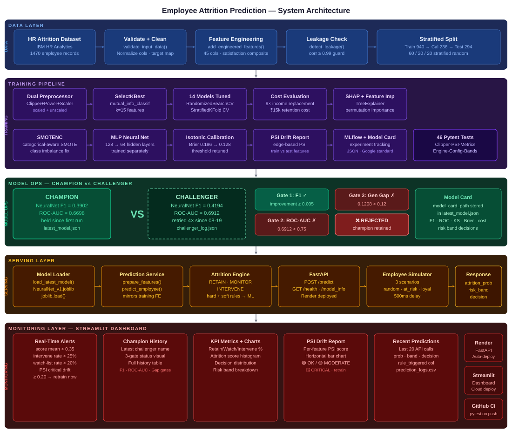

```
╔══════════════════════════════════════════════════════════════════════════════════╗
║          EMPLOYEE ATTRITION PREDICTION — 5-LAYER PRODUCTION SYSTEM               ║
╠══════════════════════════════════════════════════════════════════════════════════╣
║                                                                                  ║
║  ┌─────────────────────────────── DATA LAYER ──────────────────────────────┐     ║
║  │  HR CSV  →  Validate + Clean  →  Feature Engineering  →  Leakage Check  │     ║
║  │  1,470 employees · 45 total cols · 940/236/294 stratified split         │     ║
║  └───────────────────────────────────┬─────────────────────────────────────┘     ║
║                                      ▼                                           ║
║  ┌─────────────────────────── TRAINING PIPELINE ───────────────────────────┐     ║
║  │                                                                         │     ║
║  │  Dual Preprocessor → SelectKBest(k=15) → 14 Models Tuned (RandomSearch) │     ║
║  │  SMOTENC → MLP (128→64) → Isotonic Calibration → SHAP → PSI → MLflow    │     ║
║  │                                                                         │     ║
║  │  CHAMPION → NeuralNet  F1=0.3902  ROC-AUC=0.6698  Brier=0.1296          │     ║
║  └───────────────────────────────────┬─────────────────────────────────────┘     ║
║                                      ▼                                           ║
║  ┌──────────────────────── CHAMPION-CHALLENGER ────────────────────────────┐     ║
║  │                                                                         │     ║
║  │  Gate 1: F1 improvement  ≥ 0.005   →  ✅ PASS / ❌ FAIL                │     ║
║  │  Gate 2: ROC-AUC         ≥ 0.75    →  ✅ PASS / ❌ FAIL                │     ║
║  │  Gate 3: train-test gap  ≤ 0.12    →  ✅ PASS / ❌ FAIL                │     ║
║  │                                                                         │     ║
║  │  ALL gates pass → PROMOTED (latest_model.json updated)                  │     ║
║  │  ANY gate fails → REJECTED (champion retained, result logged)           │     ║
║  └───────────────────────────────────┬─────────────────────────────────────┘     ║
║                                      ▼                                           ║
║  ┌──────────────────────────── SERVING LAYER ──────────────────────────────┐     ║
║  │                                                                         │     ║
║  │  Model Loader → Prediction Service → Attrition Engine → FastAPI         │     ║
║  │                                                                         │     ║
║  │  POST /predict     → employee JSON  → RETAIN / MONITOR / INTERVENE      │     ║
║  │  GET  /health      → API health check                                   │     ║
║  │  GET  /model_info  → champion model card (metrics + business impact)    │     ║
║  │                                                                         │     ║
║  │  3-Tier Retention Engine: hard rules → soft rules → ML threshold        │     ║
║  └───────────────────────────────────┬─────────────────────────────────────┘     ║
║                                      ▼                                           ║
║  ┌─────────────────── MONITORING LAYER — STREAMLIT DASHBOARD ──────────────┐     ║
║  │                                                                         │     ║
║  │  Section 1: Real-Time Alerts    → score mean · intervene rate · PSI     │     ║
║  │  Section 2: Champion-Challenger → decision · 3-gate status · history    │     ║
║  │  Section 3: KPIs + Charts       → retain/watch/intervene · score dist.  │     ║
║  │  Section 4: PSI Drift           → per-feature PSI bar chart             │     ║
║  │  Section 5: Recent Predictions  → audit log · rule_triggered            │     ║
║  │  Sidebar:   Live Prediction     → enter employee → instant decision     │     ║
║  │                                                                         │     ║
║  │  Simulator: 3 scenarios (random · at_risk · loyal) → hits /predict      │     ║
║  └─────────────────────────────────────────────────────────────────────────┘     ║
╚══════════════════════════════════════════════════════════════════════════════════╝
```

---

## 📸 Dashboard Screenshots

### 🖥️ Full Dashboard UI

Real-time attrition monitoring dashboard — live sidebar prediction · Champion-Challenger system · KPI cards · PSI drift · recent predictions log.

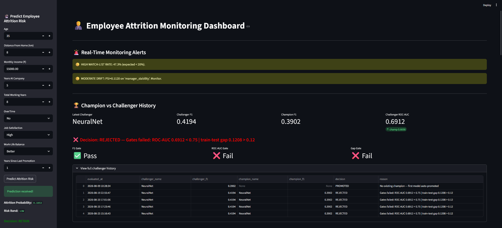

---

### 📊 Model Performance KPIs

Retain / watch-list / intervention rates, attrition score distribution histogram, and decision distribution bar chart.

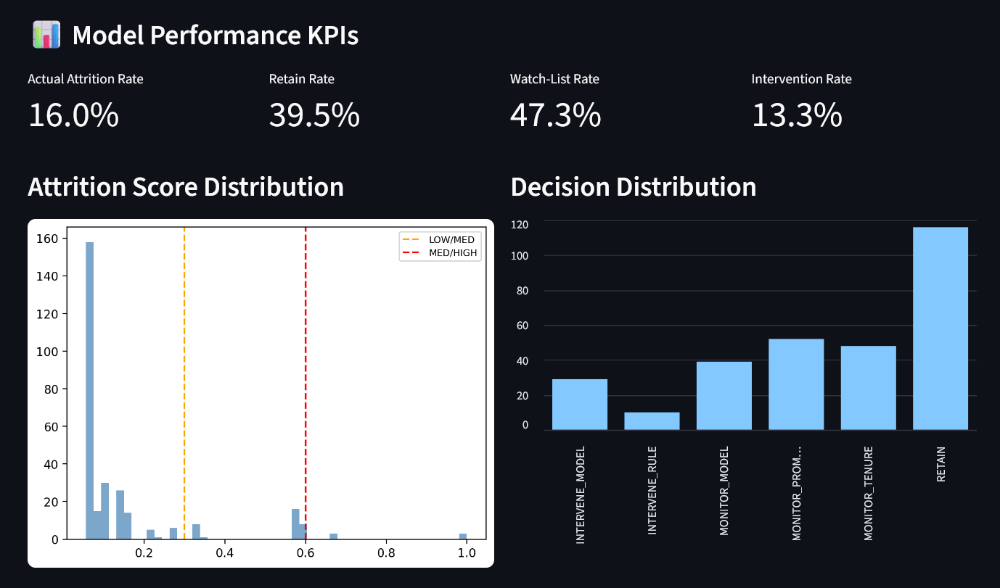

---

### 🎯 Risk Band Breakdown

LOW / MEDIUM / HIGH probability-band distribution across the monitored employee population.

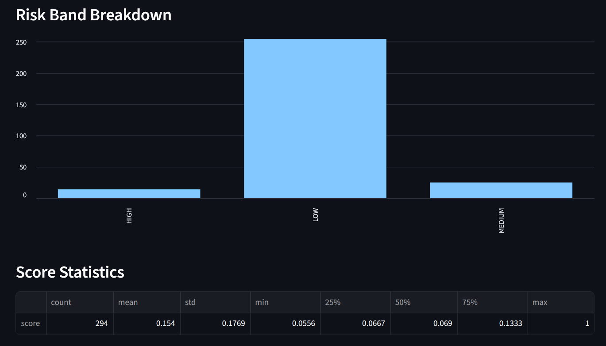

---

### 📈 Feature Drift Report (PSI)

Top drifted features (train vs test) with 🟢 OK / 🟡 MODERATE / 🔴 CRITICAL colour-coded status.

.png)

---

### 📉 PSI Drift Scores — Bar Chart

Per-feature Population Stability Index, sorted, with moderate/critical threshold lines.

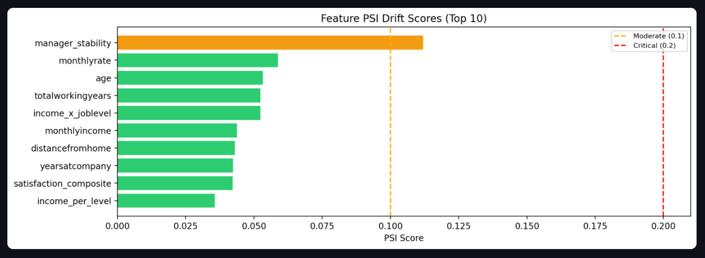

---

### 📋 Recent Predictions Log

Last 20 API predictions with probability, risk band, decision, and rule-triggered column.

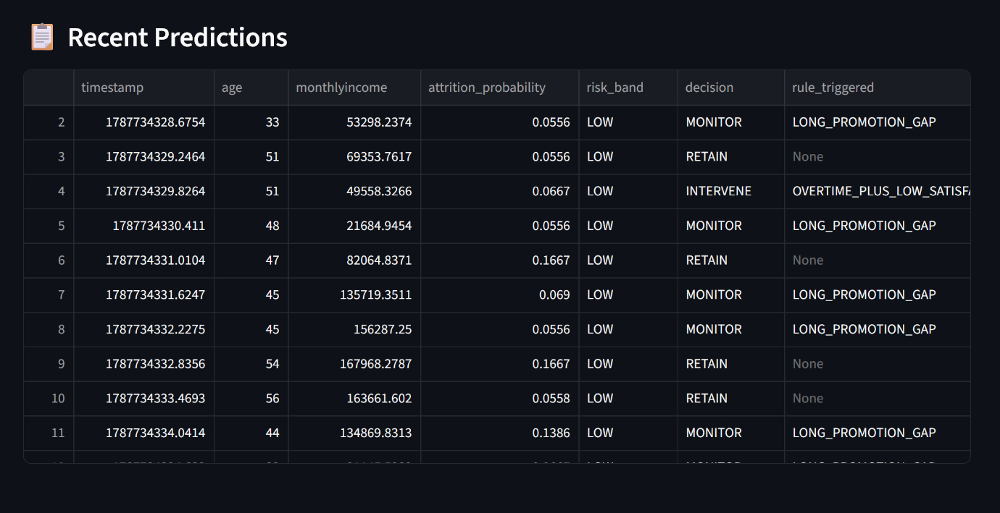

---

## 📊 Training Reports

| Confusion Matrix | ROC & PR Curves |
|---|---|
| 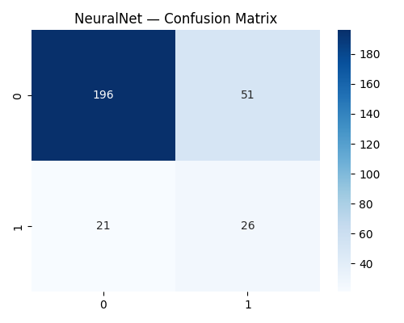 | 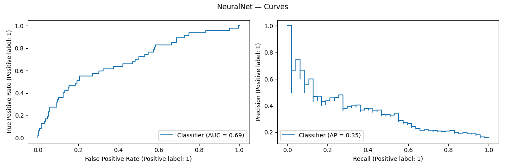 |

| Training & Model Summary | Champion-Challenger Evaluation |
|---|---|
| 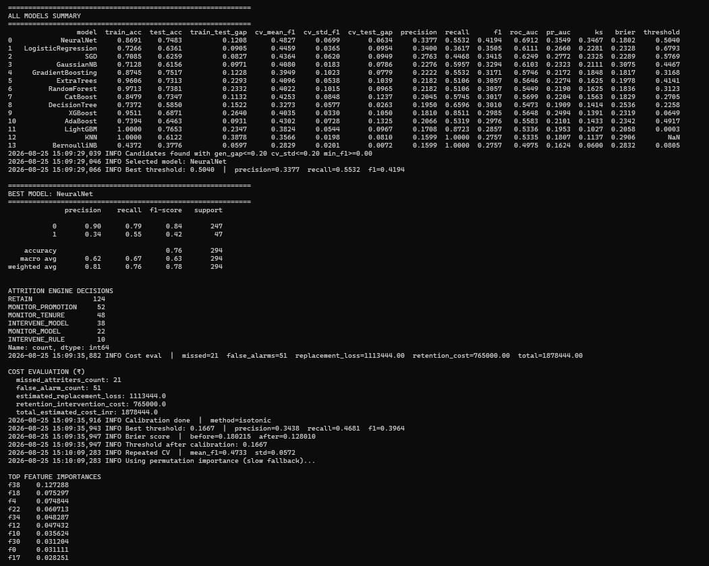 | 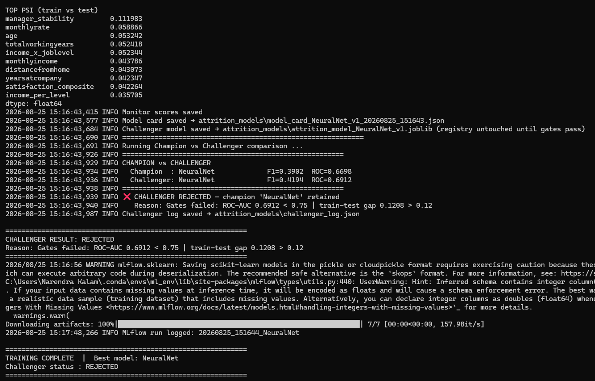 |

| Test Coverage | Simulation Run |
|---|---|
| 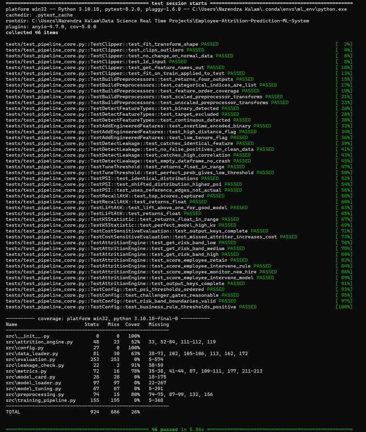 | 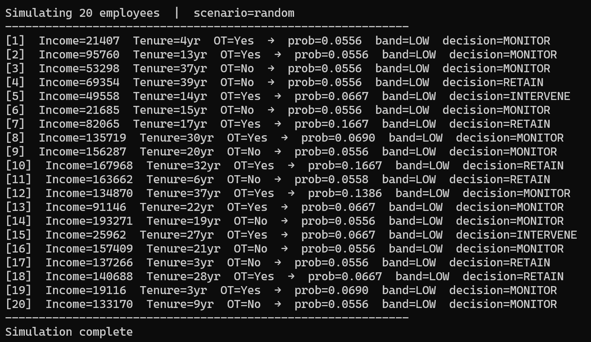 |

---

## 🎬 System Demo

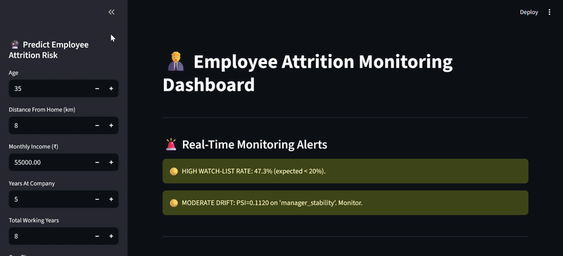

---

## 📁 Project Structure

```
Employee-Attrition-Prediction-ML-System/
│
├── src/                                     # Core ML system
│   ├── config.py                           # Constants — risk bands, gate thresholds, business rules
│   ├── data_loader.py                      # validate_input_data() · add_engineered_features() · detect_feature_types()
│   ├── preprocessing.py                    # Clipper · dual ColumnTransformer (scaled + unscaled)
│   ├── leakage_check.py                    # detect_leakage() — corr + exact-match guard
│   ├── metrics.py                          # tune_threshold · psi · KS · recall@K · lift@K · cost_sensitive_evaluation
│   ├── model_tuning.py                     # 14 model grids · RandomizedSearchCV · MLP trained separately
│   ├── attrition_engine.py                 # 3-tier RETAIN/MONITOR/INTERVENE decision engine + HR rules
│   ├── evaluation.py                       # Full eval pipeline · calibration · SHAP · challenger save
│   ├── model_card.py                       # build_model_card() / save_model_card() — Google Model Card standard
│   ├── model_loader.py                     # load_latest_model() · run_challenger_comparison() — 3-gate system
│   └── training_pipeline.py               # End-to-end orchestration (run_training())
│
├── serving/
│   └── attrition_api.py                    # FastAPI: /predict · /health · /model_info
│
├── services/
│   └── prediction_service.py               # prepare_features() → predict_employee()
│
├── monitoring/
│   └── monitoring_dashboard.py             # Streamlit: 5-section real-time monitoring dashboard
│
├── simulation/
│   └── employee_simulator.py               # 3-scenario synthetic workforce generator
│
├── tests/
│   └── test_pipeline_core.py               # 46 pytest unit tests across 10 classes — all passing
│
├── scripts/
│   ├── train_model.py                      # python scripts/train_model.py
│   ├── run_api.py                          # python scripts/run_api.py
│   ├── run_dashboard.py                    # python scripts/run_dashboard.py
│   └── run_simulation.py                   # python scripts/run_simulation.py
│
├── notebooks/
│   ├── Employee_Attrition_EDA.ipynb        # Professional EDA notebook
│   └── Employee_Attrition_EDA.html         # Rendered HTML export
│
├── data/
│   ├── sample_dataset_info.txt
│   └── sample_employee_attrition_dataset.csv   # Demo/sample IBM HR dataset for quick local testing
│
├── attrition_models/                       # Model artifacts
│   ├── attrition_model_NeuralNet_v1.joblib # Trained champion model
│   ├── latest_model.json                   # Champion registry (model path + threshold + card path)
│   ├── model_card_NeuralNet_v1_*.json      # Structured model cards (one per training run)
│   ├── challenger_log.json                 # Full Champion-Challenger comparison history
│   ├── model_experiment_results.csv        # All 14 models compared
│   ├── monitor_scores.csv                  # Test-set scores feeding the dashboard
│   └── feature_drift_report.csv            # PSI drift per feature
│
├── docs/
│   ├── architecture/
│   │   └── attrition_architecture.svg      # 5-layer system architecture diagram
│   ├── plots/
│   │   ├── confusion_matrix.png            # NeuralNet confusion matrix
│   │   └── roc_pr_curves.png               # ROC + Precision-Recall curves
│   ├── screenshots/
│   │   ├── dashboard_full_ui.png           # Full Streamlit dashboard UI
│   │   ├── model_performance_kpis.png      # KPI cards + score/decision distribution
│   │   ├── risk_band_breakdown.png         # LOW/MEDIUM/HIGH band chart
│   │   ├── feature_drift_report(psi).png   # PSI status table
│   │   ├── feature_psi_drift_scores.png    # PSI bar chart
│   │   └── recent_predictions.png          # Prediction audit log
│   ├── reports/
│   │   ├── challenger_evaluation.png       # Champion-Challenger gate results (terminal)
│   │   ├── simulation.png                  # Simulation run terminal output
│   │   ├── test_coverage.png               # pytest 46/46 coverage report
│   │   └── training_model_summary.png      # All-models summary + training log
│   └── gifs/
│       └── system_demo_employee.gif        # End-to-end system demo
│
├── logs/
│   └── prediction_logs.csv                 # API prediction audit log (auto-generated)
│
├── mlruns/                                 # MLflow experiment tracking store (auto-generated)
├── catboost_info/                          # CatBoost training artifacts (auto-generated)
├── .pytest_cache/                          # pytest cache (auto-generated)
│
├── Dockerfile                               # FastAPI production image
├── Dockerfile.dashboard                     # Streamlit dashboard container
├── docker-compose.yml                       # API + Dashboard together (ports 8000 + 8501)
├── .github/workflows/ci.yml                # GitHub Actions — pytest on every push
├── .gitignore
├── .dockerignore
├── LICENSE                                  # MIT License
├── README.md                                # This file
├── render.yaml                              # Render.com deployment config
├── requirements.txt                         # Full dependencies (training + API + dashboard)
├── requirements_api.txt                     # API-only deps (Render — stripped of shap/mlflow/catboost)
├── requirements_dashboard.txt               # Dashboard-only deps (Streamlit Cloud)
└── runtime.txt                              # Python 3.10.13
```

---

## 🚀 Quickstart

### 1. Clone & Install

```bash
git clone https://github.com/narendrakalam2001/employee-attrition-prediction-mlops.git
cd employee-attrition-prediction-mlops
pip install -r requirements.txt
```

### 2. Dataset

A demo/sample copy of the [IBM HR Analytics Attrition dataset](https://www.kaggle.com/datasets/pavansubhasht/ibm-hr-analytics-attrition-dataset) is provided in `data/` for quick local testing:

```
data/
└── sample_employee_attrition_dataset.csv   # Sample employees: 500
```

### 3. Train Model

```bash
python scripts/train_model.py
```

Expected output:
```
INFO  Data validation passed  |  shape=(1470, 31)  |  attrition_rate=0.161
INFO  Candidates found with gen_gap<=0.20 cv_std<=0.20 min_f1>=0.00
INFO  Selected model: NeuralNet
INFO  Best threshold: 0.5040  |  precision=0.3377  recall=0.5532  f1=0.4194
INFO  Calibration done  |  method=isotonic
INFO  Threshold after calibration: 0.1667
INFO  Model card saved → attrition_models/model_card_NeuralNet_v1_*.json
INFO  ❌ CHALLENGER REJECTED — champion 'NeuralNet' retained
TRAINING COMPLETE  |  Best model: NeuralNet
```

### 4. Start API

```bash
python scripts/run_api.py
# API:  http://localhost:8000
# Docs: http://localhost:8000/docs
```

### 5. Start Dashboard

```bash
python scripts/run_dashboard.py
# Dashboard: http://localhost:8501
```

### 6. Run Simulation

```bash
python scripts/run_simulation.py
# Simulating 20 employees | scenario=random
```

### 7. Run Tests

```bash
pytest tests/ -v --cov=src --cov-report=term-missing
# 46 collected · 46 passed · 0 failed (5.86s)
```

---

## 🐳 Docker

```bash
# Start everything
docker compose up --build

# API only
docker compose up api

# Dashboard only
docker compose up dashboard

# Stop
docker compose down
```

| Service | URL |
|---|---|
| FastAPI + Swagger | `http://localhost:8000/docs` |
| Streamlit Dashboard | `http://localhost:8501` |

> **Note:** Train the model locally first (`python scripts/train_model.py`) so `attrition_models/` contains trained artifacts before starting Docker.

---

## 🌐 API Reference

### POST /predict — Single Employee Risk Score

```bash
curl -X POST "http://localhost:8000/predict" \
  -H "Content-Type: application/json" \
  -d '{
    "age": 27, "distancefromhome": 25, "monthlyincome": 22000,
    "totalworkingyears": 3, "yearsatcompany": 1, "overtime": "Yes",
    "jobsatisfaction": 1, "worklifebalance": 1, "yearssincelastpromotion": 0
  }'
```

**Response:**
```json
{
  "attrition_probability": 0.1905,
  "risk_band": "LOW",
  "decision": "INTERVENE",
  "rule_triggered": "OVERTIME_PLUS_LOW_SATISFACTION",
  "latency_seconds": 0.1018
}
```

### GET /health

```json
{"status": "running", "model_loaded": true}
```

### GET /model_info

Returns the full champion model card — metrics, thresholds, cost evaluation, feature importances.

---

## 📊 All 14 Models Compared

| Model | F1 | ROC-AUC | Precision | Recall | Train-Test Gap |
|---|---|---|---|---|---|
| **NeuralNet** ⭐ | **0.3902** | **0.6698** | 0.3158 | 0.5106 | 0.1264 |
| SGD | 0.3636 | 0.6125 | 0.2824 | 0.5106 | 0.0950 |
| LogisticRegression | 0.3400 | 0.6099 | 0.3208 | 0.3617 | 0.0818 |
| GaussianNB | 0.3333 | 0.6088 | 0.2256 | 0.6383 | 0.0995 |
| GradientBoosting | 0.3171 | 0.5746 | 0.2222 | 0.5532 | 0.1228 |
| XGBoost | 0.3137 | 0.5572 | 0.2264 | 0.5106 | 0.3099 |
| AdaBoost | 0.3043 | 0.5578 | 0.2308 | 0.4468 | 0.0906 |
| CatBoost | 0.3014 | 0.5641 | 0.2222 | 0.4681 | 0.0989 |
| ExtraTrees | 0.3009 | 0.5508 | 0.2576 | 0.3617 | 0.2415 |
| LightGBM | 0.2966 | 0.5634 | 0.1770 | 0.9149 | 0.2381 |
| DecisionTree | 0.2900 | 0.5506 | 0.1895 | 0.6170 | 0.1448 |
| KNN | 0.2857 | 0.5358 | 0.1879 | 0.5957 | 0.2350 |
| RandomForest | 0.2793 | 0.5379 | 0.1894 | 0.5319 | 0.2313 |
| BernoulliNB | 0.2757 | 0.4981 | 0.1599 | 1.0000 | 0.0733 |

Full table: `attrition_models/model_experiment_results.csv`

---

## 🏆 Champion vs Challenger — 3-Gate Promotion

Every new training run is compared against the production champion using **3 promotion gates**:

| Gate | Condition | Rationale |
|---|---|---|
| F1 Improvement | Challenger must beat champion by ≥ 0.005 | Meaningful improvement only |
| ROC-AUC Threshold | ≥ 0.75 | Minimum discrimination ability for retention decisions |
| Train-Test Gap | ≤ 0.12 | No overfitting to the training set |

> **Why strict gates?** A poorly generalizing model that gets promoted wastes real manager time on false-alarm retention conversations and, worse, misses genuine flight risks. The 3-gate system ensures no model reaches production without demonstrably better discrimination and generalization than what's already live.

**Actual run history** (`attrition_models/challenger_log.json`):

```
[1] PROMOTED  — No existing champion — NeuralNet auto-promoted   (F1=0.3902, ROC=0.6698)
[2] REJECTED  — ROC-AUC 0.6912 < 0.75 | train-test gap 0.1208 > 0.12   (F1=0.4194, ROC=0.6912)
[3] REJECTED  — same gate failure, retrained 2026-08-20 17:01
[4] REJECTED  — same gate failure, retrained 2026-08-20 17:23
[5] REJECTED  — same gate failure, retrained 2026-08-25 15:16
```

> The champion set on day one (F1=0.3902, ROC=0.6698) has held through 4 later retraining attempts — every challenger improved F1 but never cleared the ROC-AUC ≥ 0.75 gate, so the original NeuralNet remains in production. This is the 3-gate system working as designed: F1 alone isn't sufficient to promote a model with weaker discrimination.

Results are visible in the dashboard Section 2 with per-gate ✅/❌ status and full history table.

---

## 🎯 3-Tier Retention Decision Engine

Unlike a binary "will leave / won't leave" model, this system uses a **3-tier HR decision engine**:

| Decision | Trigger |
|---|---|
| `RETAIN` | Low attrition probability + no rule flags — no action needed |
| `MONITOR` | Borderline ML score OR soft rule (new hire ≤1yr, promotion gap ≥5yr) |
| `INTERVENE` | High attrition probability OR hard rule (sustained overtime + chronic dissatisfaction) |

Rules are evaluated **before** the ML score — the same priority order real HR retention systems use, so a known strong driver (overtime + low satisfaction) triggers action even if the raw ML probability alone sits below threshold.

```json
// At-risk profile: overtime=Yes, satisfaction=1/4, new hire (1yr tenure)
{
  "attrition_probability": 0.1905,
  "risk_band": "LOW",
  "decision": "INTERVENE",
  "rule_triggered": "OVERTIME_PLUS_LOW_SATISFACTION"
}
```

```json
// Loyal profile: 15yr tenure, satisfaction=4/4, no overtime, senior level
{
  "attrition_probability": 0.0423,
  "risk_band": "LOW",
  "decision": "RETAIN",
  "rule_triggered": null
}
```

---

## 🔬 13 Engineered Features

| Feature | Business Signal |
|---|---|
| `tenure_ratio` | Company tenure ÷ total career length — loyalty vs job-hopping |
| `promotion_gap_ratio` | Years since promotion ÷ tenure — stagnation risk |
| `manager_stability` | Years with current manager ÷ tenure — relationship continuity |
| `role_stagnation` | Years in current role ÷ tenure — growth stall risk |
| `job_hopping_score` | Companies worked ÷ career length — mobility tendency |
| `avg_years_per_company` | Career length ÷ companies worked — typical stay length |
| `income_per_level` | Income normalized by job level — pay-band positioning |
| `hike_ratio` | Percent salary hike ÷ 100 |
| `satisfaction_composite` | Mean of 4 satisfaction survey scores — cleaner engagement signal |
| `low_satisfaction_flag` | Composite satisfaction ≤ 2 — hard rule trigger |
| `high_distance_flag` | Distance from home ≥ 20km — commute fatigue trigger |
| `low_tenure_flag` | Years at company ≤ 1 — onboarding flight-risk trigger |
| `long_promotion_gap_flag` | Years since promotion ≥ 5 — stagnation trigger |

---

## 💰 Cost-Sensitive Business Impact Evaluation

HR-grade replacement-cost framework, on the held-out test set (294 employees):

| Event | Cost Model | Test Set Result |
|---|---|---|
| Missed attriter (FN) | 9× MonthlyIncome (≈ ₹5–15L replacement cost) | 23 missed → ₹11.79L |
| False alarm (FP) | ₹15,000 wasted retention intervention | 52 false alarms → ₹7.80L |
| **Total estimated cost** | | **₹19.59L** on 294 employees |

This framing is what makes the model actionable to HR leadership: it's not "F1 = 0.39," it's "here's the ₹ cost of the errors this model makes, and here's what it saves versus doing nothing."

---

## 📈 Monitoring Dashboard — 5 Sections

| Section | What it shows |
|---|---|
| **1. Real-Time Alerts** | Score mean > 0.35 · intervene rate > 25% · watch-list rate > 20% · PSI critical |
| **2. Champion-Challenger** | Latest decision badge · 3-gate pass/fail status · full history table |
| **3. KPIs + Charts** | Retain/watch/intervene rates · score distribution · decision & risk-band breakdown |
| **4. PSI Drift** | Per-feature PSI bar chart · 🟢 OK / 🟡 MODERATE / 🔴 CRITICAL |
| **5. Recent Predictions** | Last 20 API calls · probability · band · decision · rule triggered |
| **Sidebar** | Live prediction — enter employee attributes → instant RETAIN/MONITOR/INTERVENE |

---

## 🧪 Test Coverage — 46/46 Passing

46 unit tests across 10 test classes:

```
tests/test_pipeline_core.py
  TestClipper                 (6)  — fit/transform shape · outlier clipping · 1D input · feature names ·
                                      no-change on normal data · fit-on-train applied-to-test
  TestBuildPreprocessors       (5)  — 4-tuple return · categorical indices list · feature order coverage ·
                                      scaled/unscaled transforms produce no NaNs
  TestDetectFeatureTypes       (3)  — binary detection · target exclusion · continuous detection
  TestAddEngineeredFeatures    (3)  — overtime binary encoding · high-distance flag · low-tenure flag
  TestDetectLeakage            (4)  — identical feature caught · clean data no false positive ·
                                      high correlation caught · empty dataframe no crash
  TestTuneThreshold            (2)  — returns float in range · perfect separation gives low threshold
  TestPSI                      (3)  — identical distributions · shifted distribution higher PSI ·
                                      uses reference edges not actual
  TestRecallAtK/LiftAtK/KS     (6)  — top-K capture · lift > 1 for good model · KS bounds · perfect-model KS
  TestCostSensitiveEvaluation  (2)  — output keys complete · missed attriter increases cost
  TestAttritionEngine          (8)  — risk band boundaries · RETAIN/MONITOR/INTERVENE decisions ·
                                      rule_triggered correctness · output keys complete
  TestConfig                   (4)  — PSI threshold ordering · challenger gate sanity ·
                                      risk band boundaries valid · business rule thresholds positive

Result: 46 passed · 0 failed (5.86s)
```


```bash
pytest tests/ -v --cov=src --cov-report=term-missing
```

---

## 🧠 Technical Standards

| Component | Implementation |
|---|---|
| **Models Evaluated** | LR · SGD · KNN · GaussianNB · BernoulliNB · DecisionTree · RandomForest · ExtraTrees · GradientBoosting · AdaBoost · XGBoost · LightGBM · CatBoost · **MLP (NeuralNet)** |
| **Class Imbalance** | SMOTENC — categorical-aware SMOTE (16.1% positive rate) |
| **Preprocessing** | IQR-based `Clipper` → Yeo-Johnson `PowerTransformer` (skewed) → `StandardScaler`; separate unscaled pipeline for tree models |
| **Feature Selection** | `SelectKBest` (mutual information), k=15 |
| **Hyperparameter Search** | `RandomizedSearchCV` with `StratifiedKFold(5)`, scoring=F1 |
| **Calibration** | Isotonic regression on held-out calibration split — Brier 0.1864 → 0.1296 |
| **Explainability** | SHAP top features + permutation feature importance |
| **Leakage Detection** | Exact-match + correlation ≥ 0.99 guard, run before training |
| **Champion-Challenger** | 3-gate: F1 improvement ≥ 0.005 · ROC-AUC ≥ 0.75 · train-test gap ≤ 0.12 |
| **Experiment Tracking** | MLflow — params, metrics, model artifact per run |
| **Model Card** | Google Model Cards standard — JSON with metrics, thresholds, cost evaluation |
| **CI/CD** | GitHub Actions — pytest on every push |
| **Deployment** | Render.com (FastAPI) + Streamlit Cloud (Dashboard) |

---

## 🛠 Tech Stack

Python · Scikit-Learn · XGBoost · LightGBM · CatBoost · imbalanced-learn · FastAPI · Uvicorn · Streamlit · SHAP · MLflow · Pytest · Pandas · NumPy · Matplotlib · Seaborn · Docker · GitHub Actions · Render · Streamlit Cloud

---

## 🛡️ Ethical Considerations

- Model outputs should support, not replace, manager judgment — a MONITOR/INTERVENE flag is a prompt for a human conversation, not an automated action
- IBM's HR Attrition dataset is synthetic-but-realistic; real organizational data may carry different (and potentially biased) correlations between demographic attributes and attrition
- `gender`, `maritalstatus`, and `age` are included as model inputs — regular fairness audits are recommended before using attrition scores in any decision affecting compensation, promotion, or termination
- The model has **not** been validated across industries, geographies, or company sizes outside this dataset's IT/consulting-style workforce profile
- With only 16.1% positive class and ROC-AUC 0.67, false positives (52 on 294 test employees) are common — treat MONITOR/INTERVENE as a triage signal, not a verdict
- Champion has been retained through 4 challenger rejections since 2026-08-19 — all challengers improved F1 but failed the ROC-AUC ≥ 0.75 gate, meaning further feature engineering or model architecture changes are needed before discrimination improves meaningfully

---

## 👤 About

**Narendra Kalam** — MSc Computer Science (Gold Medalist — NASSCOM, Full Stack Data Science + AI)

> Building 20+ industry-level, end-to-end ML systems across all domains.

[](https://www.linkedin.com/in/narendra-kalam/)
[](https://www.kaggle.com/narendrakalam)
[](https://narendrakalam2001.github.io/)
[](mailto:kalamnarendra2001@gmail.com)

### Portfolio Projects

| # | Project | Domain | Champion Model | Key Metric |
|---|---|---|---|---|
| 1 | Credit Card Fraud Detection | BFSI / Fintech | ExtraTrees | F1 = 0.8962 · 284K transactions |
| 2 | Credit Risk Prediction | BFSI / Lending | LightGBM | F1 = 0.9741 · ROC-AUC = 0.9991 |
| 3 | Customer Churn Prediction | Telecom / BFSI | CatBoost | F1 = 0.634 · Recall = 0.7312 |
| 4 | House Price Prediction | Real Estate | CatBoost | RMSE = $20,128 · R² = 0.9053 |
| 5 | Store Sales Forecasting | Retail / Supply Chain | LightGBM (Ensemble) | RMSLE = 0.3739 · R² = 0.9761 |
| 6 | Energy Demand Forecasting | Energy / Utilities | ElasticNet | RMSE = 712.04 MW · R² = 0.9759 |
| 7 | Stock Price & Risk Forecasting | Fintech / Capital Markets | Ridge | DirAcc = 53.44% · Sharpe = 0.80 |
| 8 | Resume Screener AI | HR Tech | LightGBM | F1 = 0.7608 · Top-3 = 0.9416 |
| 9 | ABSA Sentiment Analysis | E-Commerce / Banking | RidgeClassifier | Macro-F1 = 0.6212 · ROC-AUC = 0.823 |
| 10 | Fake News Detector | Media Tech / Gov Tech | XGBoost | F1 = 0.9993 · ROC = 1.0000 |
| 11 | BC5CDR Clinical NER | Biomedical NLP | BioBERT | F1 = 0.8847 · Chemical F1 = 0.9239 |
| 12 | News Topic Modeling | Media Analytics | LDA (Gensim) | Cv = 0.6225 · Diversity = 0.92 |
| 13 | Chest X-Ray Diagnosis | Healthcare AI | DenseNet121 | Mean AUC = 0.7864 · 14 classes |
| 14 | Real-Time Object Detection | Computer Vision / Retail-Security | YOLOv8s | mAP50-95 = 0.5341 · 32 FPS |
| 15 | Face Emotion Recognition | EdTech / Retail CX | CNN-from-scratch | Macro-F1 = 0.5950 · 7 classes |
| 16 | Customer Segmentation Engine | E-Commerce / BFSI | DBSCAN (Unsupervised) | Silhouette = 0.4056 |
| 17 | Market Basket Analysis (Instacart) | Retail / Quick-Commerce | Apriori | 68,820 rules · mean lift = 15.66 |
| 18 | E-Commerce / OTT Recommender | E-Commerce / Streaming | Hybrid (SVD + Content) | NDCG@10 = 0.0407 · 4 candidates |
| 19 | Hospital Readmission Prediction | Healthcare / Hospital Ops | ExtraTrees | F1 = 0.2702 · ROC-AUC = 0.6513 |
| 20 | HR Policy Intelligence Chatbot | HR Tech / Enterprise GenAI | Gemini 3.6 Flash + RAG | 30/30 tests · guardrail threshold=0.35 |
| 21 | **Employee Attrition Prediction** | **HR Tech / People Analytics** | **NeuralNet (MLP)** | **F1 = 0.3902 · ROC-AUC = 0.6698** |

---

## 📚 References

- Rajpurkar et al. — dataset methodology inspiration for structured Champion-Challenger MLOps design
- IBM HR Analytics Employee Attrition & Performance Dataset — [Kaggle](https://www.kaggle.com/datasets/pavansubhasht/ibm-hr-analytics-attrition-dataset)
- Chawla et al. (2002) — [SMOTE: Synthetic Minority Over-sampling Technique](https://arxiv.org/abs/1106.1813)
- Lundberg & Lee (2017) — [A Unified Approach to Interpreting Model Predictions (SHAP)](https://arxiv.org/abs/1705.07874)

---

## 📄 License

MIT License — see [LICENSE](LICENSE)